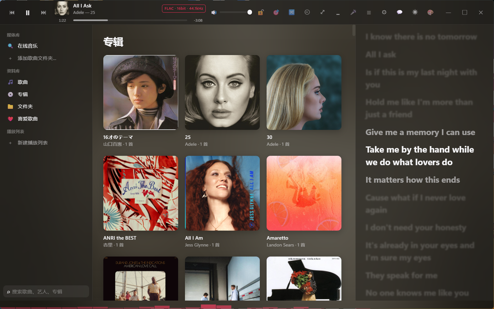
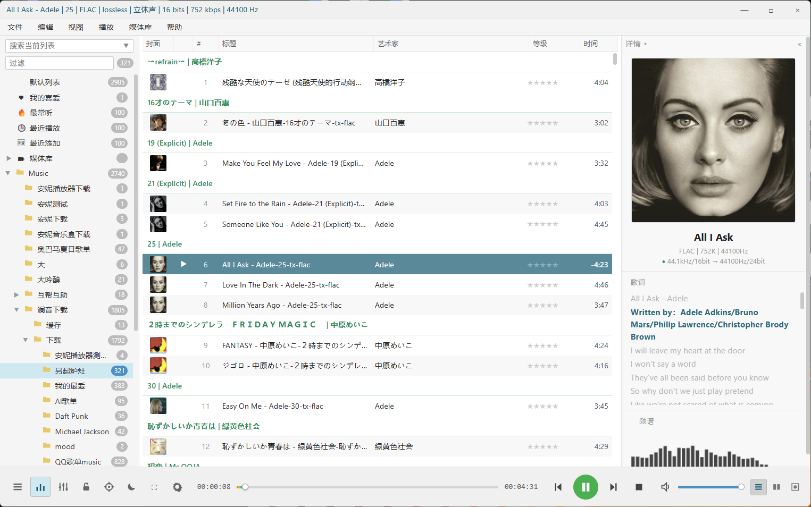
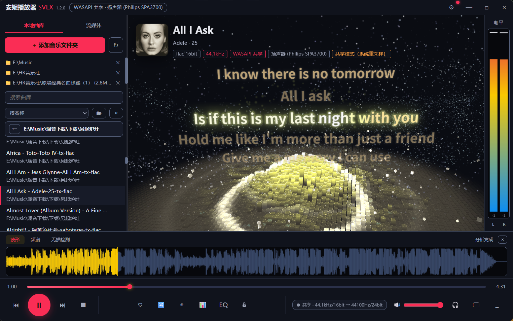
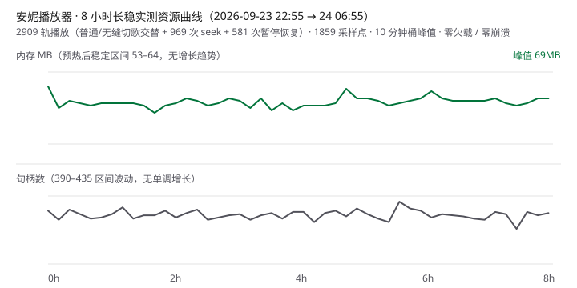

# 安妮播放器融合版（AnniePlayer SVLX）

> Windows HiFi 桌面音乐播放器
> 自研 AnnieEngine 音频引擎 × WASAPI / ASIO × VST3 × 本地无损曲库 × 洛雪音乐生态 × 三套界面主题
>
> 无敌章鱼哥出品 · 交流 Q 群：**1023637098**（更多 HiFi 资源群公告获取）

[](https://github.com/Zhou1019-1/AnniePlayer-LXversion/releases/latest)
[](LICENSE)

AnniePlayer 将 Electron UI、独立 .NET 9 音频引擎、FFmpeg 解码与 VST3 DSP 链组合成完整的桌面音频系统：UI 负责人机交互，音频实时处理全部交给独立引擎进程，两端经 JSON-RPC（stdio）通信。

**[下载安装](https://github.com/Zhou1019-1/AnniePlayer-LXversion/releases/latest) · [界面截图](#界面截图) · [架构](#架构) · [性能实测](#性能实测) · [音频正确性测试](#音频正确性测试) · [更新日志](更新日志.md) · [全功能说明书](#全功能说明书)**

## 下载安装

**[→ 前往 Releases 下载最新安装包](https://github.com/Zhou1019-1/AnniePlayer-LXversion/releases/latest)**（`annie-player-svlx-setup-x.y.z.exe`，约 160MB）

- 系统要求：**Windows 10 / 11 64 位**（内置全部运行库，无需装 .NET / VLC / 任何依赖）
- 安装包未购买代码签名，SmartScreen 提示时点 **「更多信息 → 仍要运行」** 即可
- **在线更新**：V3.3.1 之后的版本支持差量自动更新，打开软件即静默下载、下次启动生效（每次只需下载几 MB）
- 覆盖安装 / 升级不会丢失曲库、歌单与设置（数据在 `%APPDATA%\annie-player-svlx`）

## 界面截图

| Apple Music 主题 | FB2K 主题 | 粒子舞台 |
| :---: | :---: | :---: |
|  |  |  |

## AnnieEngine：独立音频引擎

AnniePlayer 的核心音频后端是独立进程 **AnnieEngine**（.NET 9）。Electron 不直接参与音频输出，只通过 JSON-RPC 下发控制指令、接收状态事件。

```text
                AnniePlayer SVLX
                      │
       ┌──────────────┴──────────────┐
       │                             │
  Electron UI                  LX Music SDK
  （三套主题/曲库/交互）         （五平台在线音源）
       └──────────────┬──────────────┘
                      │ JSON-RPC (stdio)
                      ▼
              ┌───────────────┐
              │  AnnieEngine  │  独立进程 · .NET 9
              │  播放状态机    │
              └──────┬────────┘
                     │
   ┌─────────┬───────┼────────┬──────────┐
   ▼         ▼       ▼        ▼          ▼
 解码       DSP     插件    混音        输出
 FFmpeg   Float32  VST3   Gapless    WASAPI
 全格式   PCM 管线         Crossfade  独占/共享
                     │                ASIO
                     ▼                 │
        EQ/PEQ/声道矩阵/响度/限幅       ▼
                     │                DAC
                     ▼
              重采样（swresample/soxr）
```

**引擎特性**

- 独立进程架构：渲染层崩溃不影响播放链路；引擎异常退出可独立重启恢复
- FFmpeg 解码（本地文件 / HTTP 流 / CUE / SACD ISO），float32 PCM 域处理
- WASAPI 独占 / 共享、ASIO 输出；DSD 转 PCM / DoP 直通
- DSP 链：15 段图示 EQ + 8 段参量 EQ + 声道矩阵 + 响度增益 + 自动前级 + 软限幅，全部热更新不破音
- Gapless 无缝播放与交叉淡入（引擎内混音器，切歌不重建输出流）
- 输出健康监控：缓冲水位 / 欠载计数 / 限幅触发实时上报
- 内置 `test.decode` 自测接口：不开输出设备拉取整条 DSP 链返回计量指标，供 CI 断言

**为什么用独立引擎？** 音频实时处理对时延与稳定性敏感：独立进程让 UI 线程完全离开音频回调路径，解码 / DSP / 输出与界面解耦，WASAPI / ASIO / VST3 有独立运行环境，引擎也可脱离 UI 单独做自动化正确性测试。

### 引擎内部信号链

```text
源文件 / 流（FLAC · APE · DSD · CUE · SACD ISO）
    ↓
FFmpeg 解码 ──────── DSD64–512（原生 / DoP / 转 PCM 三档）
    ↓
Float32 PCM（全程浮点）
    ↓
VST3 插件槽位 ×N（实时链，可挂原生编辑器）
    ↓
图示 EQ 15 段（32Hz–16kHz）
    ↓
参量 EQ 8 段（f / g / Q）
    ↓
声道矩阵（上混 / 下混 / 平衡 / 互换 / 5.1 环绕）
    ↓
响度增益（ReplayGain / 预设均衡）
    ↓
前级限幅（防削波）
    ↓
重采样（soxr 高精度，可选 44.1k–384k）
    ↓
┌───┴───┐
WASAPI   ASIO
独占/共享
└───┬───┘
    ↓
   DAC
```

## 音质链路：Bit-perfect 可验证

「设置中心 → 音频输出 → 输出健康」的链路图可点击展开，11 个环节逐段显示真实参数并给出 bit-perfect 判定（V4.0.1）。两种典型状态：

**直通状态**（输出格式匹配且未启用任何 DSP / 重采样）：

```text
FLAC 24bit/96kHz
  → FFmpeg 解码 → Float32
  → DSP 全部直通（VST/EQ/PEQ/矩阵/响度 OFF）
  → 无重采样
  → WASAPI 独占 24bit/96kHz
  → DAC
  ✓ BIT-PERFECT
```

**DSP 激活状态**（数字域处理中，每一环都可查证，不再是 bit-perfect）：

```text
FLAC 24/96
  → Float32
  → 参量 EQ +3dB @1kHz
  → 响度均衡（标准模式 -3.0dB）
  → 限幅待命（余量 +5.0dB）
  → 重采样 96k → 192k（soxr）
  → WASAPI 独占 24/192
  → DAC
  ✗ 非 bit-perfect（原因：响度 / EQ / 重采样，浮层逐项列出）
```

## 性能实测

曲库性能 Benchmark（`npm run bench:library` 可自行复现；扫描列为真实文件实测，启动/排序/搜索/内存为合成数据层实测，**排序直接执行生产代码 listWorker.js**）：

| 曲库规模 | 扫描（遍历+拼音排序） | 元数据解析（估算） | 启动加载 | 排序·名称 | 排序·专辑分组 | 搜索 | 内存占用 |
| ---: | ---: | ---: | ---: | ---: | ---: | ---: | ---: |
| 1,000 | 70 ms | 1.6 s（冷启动） | 5 ms | 2 ms | 2 ms | 0 ms | 1 MB |
| 10,000 | 131 ms | 3.3 s | 26 ms | 19 ms | 19 ms | 3 ms | 6 MB |
| 50,000 | 532 ms | 13.7 s | 107 ms | 80 ms | 118 ms | 18 ms | 25 MB |
| 100,000 | — | — | 212 ms | 160 ms | 271 ms | 42 ms | 49 MB |
| 200,000 | — | — | 454 ms | 297 ms | 543 ms | 49 ms | 77 MB |

实测环境：Intel Core Ultra 9 275HX / Node 24 / Windows 11（数据随机型与磁盘波动，数量级可靠）。元数据解析仅在首次全量扫描发生，之后按文件修改时间增量更新；20 万首数据层存储 JSON 约 33 MB。

长稳实测（`npm run test:soak` 自动出报告）：



| 时长 | 场景 | 播放 | 内存 | 句柄/线程 | 欠载 | 结果 |
| --- | --- | --- | --- | --- | --- | --- |
| 8h（2026-09-23→24） | WASAPI 共享 · gapless 开 · 混合采样率素材（44.1k/48k/96k/单声道），普通/无缝切歌交替 + 969 次 seek + 581 次暂停恢复 | 2909 轨零错误 | 预热后稳定 53–64MB（峰值 69MB），无增长趋势 | 390–435 波动无单调增长 / 14–21 波动 | 0 次（1859 采样点） | ✓ PASS |

24h/48h 长稳数据积累中，跑完补到这里。

## 音频正确性测试

引擎内置 `test.decode` 自检接口（不依赖声卡，拉取整条 DSP 链返回实测指标），每次提交由 CI 自动执行（ci.yml 与 release.yml 双闸门）：

**27 / 27 PASS**

- ✓ 采样率直通（44.1k / 48k）　✓ 重采样（soxr：帧数精确 + 带宽保持）
- ✓ 声道矩阵（单声道→立体声 / 立体声→单声道 / 自定义矩阵 / 5.1 环绕能量守恒）
- ✓ 图示 EQ（+6dB @1kHz）　✓ 参量 EQ（增益 / 段间叠加 / 全关直通 / 非法参数拒绝）
- ✓ 前级限幅（TP>1 压回阈值）　✓ 防削波链（EQ +12dB 时限幅自动待命）
- ✓ 响度增益　✓ 削波恢复　✓ 边界用例（空文件 / 极端音量 / 声道探测 / 循环受控 / 快速播放）

复现：`npm run test:audio`

## 三套界面主题（设置中心 → 常规，随时切换）

| 主题 | 风格 | 适合 |
| --- | --- | --- |
| **Apple Music** | 磨砂玻璃 + 封面氛围背景 + 大字逐行歌词，亮/暗双主题 | 默认主题，颜值党 |
| **FB2K** | 仿 foobar2000 经典布局，信息密度高，虚拟滚动面向大规模曲库优化 | 效率党 |
| **粒子舞台** | Three.js 3D 粒子可视化舞台，13 个视觉预设，节拍驱动相机 | 视觉党、投屏氛围 |

## 技术栈

| 层 | 技术 |
| --- | --- |
| UI | Electron / JavaScript |
| 音频引擎 | C# / .NET 9（独立进程，JSON-RPC stdio） |
| 解码 | FFmpeg |
| 音频输出 | WASAPI（独占/共享）/ ASIO |
| DSP | 自研 float32 PCM 管线（EQ/PEQ/声道矩阵/响度/限幅） |
| 插件 | VST3 |
| 可视化 | Three.js |
| 在线音源 | 洛雪 musicSdk（酷狗/酷我/咪咕/QQ/网易） |
| 构建 / CI | npm / electron-builder / GitHub Actions |
| 测试 | lavfi 合成音源 + 引擎自测接口 27 项断言 / 冒烟测试 |

## 项目状态

当前版本：**V4.0.4**（V4 · Audio Core & Reliability：功能冻结，专注音频内核可靠性与架构）

**已完成**

- [x] 本地曲库（全格式 / CUE / SACD ISO / 假无损检测 / 标签批量编辑）
- [x] WASAPI 独占 / 共享、ASIO、DSD（转 PCM / DoP）
- [x] DSP 链：15 段 EQ / 参量 EQ / 声道工具箱 / 响度均衡（EBU R128 + ReplayGain 直读）
- [x] VST3 效果器链（原生编辑器 / 性能监控 / 崩溃自动旁通）
- [x] Gapless 无缝播放 / 交叉淡入
- [x] 洛雪五平台在线音源（搜索/播放/下载/歌单导入）
- [x] 三套界面主题 / 桌面歌词 / SMTC 系统媒体控制
- [x] 差量自动更新 / 引擎崩溃熔断与恢复 / 诊断包导出
- [x] CI：JS 语法 + 引擎编译 + 冒烟测试 + **音频正确性测试集（27 项断言）** 双闸门
- [x] 引擎核心模块化拆分（RPC 分发 / DSP / VST / 播放控制 四 partial class）
- [x] 长稳测试脚本（`npm run test:soak`：循环播放 + 内存/句柄/欠载采样，Markdown 报告）——**8 小时实测 PASS**：2909 轨零错误，内存 53–64MB 收敛，零欠载
- [x] 曲库性能 Benchmark 工具（`npm run bench:library`：1k~20 万级，排序直测生产 listWorker 代码）
- [x] am.js UI 层拆分（2448 行单 IIFE → 核心数据/在线音乐/歌词/界面构建/状态刷新 5 片，内部模块桥接，切片拼接与原稿逐字节一致 + 引用审计 + 沙箱烟测三重校验，零行为变更）

**进行中（V4 路线）**

- [ ] 长稳与曲库实测数据积累（24h/48h 连续播放、20 万级真实曲库）

## 核心能力

**音质链路**
- WASAPI 独占 / 共享、ASIO 直通（面板/采样率/缓冲控制）、DSD 转 PCM / DoP
- 输出格式匹配且未启用重采样时可达 bit-perfect 直通（状态点绿/黄实时指示，悬停看原因）
- 15 段图示 EQ + 8 段参量 EQ（引擎热更新不破音）、声道工具箱（平衡/互换/单声道/反相）
- 响度均衡 EBU R128（目标 -16 LUFS，**ReplayGain 标签直读免分析**）
- 削波防护（自动前级 + tanh 软限幅）、重采样质量档位（标准 / 高质量 64 阶滤波）
- 无缝播放 Gapless（切歌保持输出流，间隙毫秒级）、交叉淡入 0–10s
- 输出设备打开失败时自动回退 WASAPI 共享输出并弹提示
- 音质链路图：源 → DSP 各段 → 输出可视化，点击展开全参数对照（Bit-perfect 结论 + 原因）

**曲库管理**
- 全格式：FLAC / APE / WAV / DSF / DFF / TTA / M4A / MP3 / OGG / OPUS / WMA…
- CUE 整轨分轨、**SACD ISO 分轨**（sacd_extract）
- 标签编辑器（单曲 + **批量**，勾选式写回）、在线匹配歌词/封面（五平台）
- 假无损批量检测（Goertzel 频谱分析）、重复歌曲检测、播放统计
- 自建播放列表（三主题共享）、喜爱列表、收藏不依赖云端

**在线音乐（洛雪深度融合）**
- 五大平台搜索/播放/下载：酷狗 / 酷我 / 咪咕 / QQ / 网易
- 音质分级 Hi-Res 24bit / 无损 / 320K / 128K（URL 实际格式校验，虚标自动降级）
- 榜单 / 歌单广场、**歌单链接一键导入**（五平台链接或纯 ID）
- **批量下载已加载结果**、搜索历史、自定义音源脚本导入（vm 沙箱）

**其他**
- 桌面歌词（独立透明窗，逐字卡拉OK）、三主题逐字歌词、**歌词偏移微调（±0.5s 按曲记忆）**
- 迷你模式（**一键置顶 📌**）、AM 沉浸播放页（**待播清单可拖拽排序/移除**）
- **SMTC 系统媒体控制**（媒体键全局控制、系统浮层显示封面）、任务栏进度条
- **氛围模式**（全屏实时频谱）、AM 底部频谱条、**强调色自定义**（7 色板三主题同步）
- **听歌报告**（Top 歌曲/艺术家/专辑、总时长、分享图一键复制）、更新播报、首次启动引导
- 全局快捷键（媒体键 + Ctrl+Alt 组合）、播放模式五种、播放定时三种
- VST3 效果器链（原生编辑器界面 / 湿声平滑过渡 / 每插件耗时 / 方案导入导出 / A-B 对比）
- 设置中心内置「**使用说明**」（说明书应用内版，全功能可搜索）

## 为什么做这个项目

AnniePlayer 最初只是一个本地音乐播放器。随着需求增加，UI、曲库、网络音源与音频输出之间的耦合越来越复杂，项目逐渐演变成**由独立音频引擎驱动的 Windows HiFi 播放平台**。

V4 起项目重点从「实现更多功能」转向：音频链路正确性（可断言的自动化测试）、实时处理稳定性（长稳监控）、引擎与 UI 解耦（模块化拆分）、大规模曲库性能、故障诊断与恢复。

<!-- HELP:BEGIN -->
<!-- 本章节由 scripts/gen-readme-help.js 自动生成（源：annie/renderer/js/local/helpContent.js），请勿手改 -->

## 全功能说明书

### 快速上手

- **这是什么**：Windows 10/11 桌面 HiFi 播放器：自研 AnnieEngine 音频引擎（独立进程，WASAPI 独占/ASIO 输出，Bit-perfect）+ 3D 粒子视觉 + 洛雪音乐在线生态，三者共享同一曲库与播放队列
- **三套界面主题**：粒子舞台（默认，视觉优先）/ 仿 FB2K（效率优先）/ Apple Music（美观优先）；设置中心 → 常规 即时切换，播放不中断
- **第一次使用**：添加音乐文件夹（侧栏 ＋ 或 AM「添加歌曲文件夹」）→ 自动扫描 → 点击曲目播放；新用户有三步引导
- **支持的格式**：FLAC / APE / WavPack / TAK / DSF / DFF / WAV / AIFF / MP3 / AAC / OGG / OPUS；CUE 整轨分轨；SACD ISO 自动分轨；HTTP/HTTPS 流媒体
- **DSD 输出**：设置中心 → 音频输出：转 PCM（默认）/ DoP / Native（ASIO DSD）；设备不支持时自动回落
- **便携模式**：在程序 exe 同目录新建名为 portable 的文件夹，所有数据即存入该目录，U 盘带走即用
- **数据目录**：标准模式 %APPDATA%\安妮播放器融合版V3\；便携模式 程序目录 portable\userData\

### 粒子舞台界面（默认主题）

- **顶栏**：Logo 区可拖拽窗口；3 秒内连击版本号 5 次打开性能调试面板；后端徽章显示当前输出设备（独占点亮金色）；⚙ 设置（Ctrl+,）
- **左侧栏 · 曲库**：＋ 添加文件夹 / ↻ 重扫 / 文件夹 chip 过滤（✕ 移除不删文件）/ 搜索框（回车跳在线搜索）/ 排序下拉 / 🗂 平铺↔文件夹网格 / « 收起侧栏
- **智能列表**：平铺视图顶部：全部音乐 / 我的喜爱 / 最常听 / 最近播放 / 最近添加 / ✨ 每日推荐（本地曲库每天一份：偏好 60% + 探索 40%，排除今天已播）/ 专辑 / 艺术家
- **智能歌单生成器**：设置 → 曲库工具：按艺术家/专辑/流派/播放次数/最近 N 天播放/仅无损组合筛选曲库，实时预览匹配数，一键「生成并播放」或存为播放列表（三主题共享）
- **曲目列表操作**：单击播放；♡ 收藏；⚠ 假无损可疑标记（悬停看理由）；拖放文件到列表上/下半插入对应位置
- **左侧栏 · 流媒体**：导入洛雪音源脚本（.js）；五平台切换；音质下拉（Hi-Res/无损/极高/标准）；单击结果即播；⬇ 下载；搜索历史自动记忆；「下载已加载 N 首」批量下载
- **中央舞台区**：封面氛围背景（可关）；粒子画布左键旋转/滚轮缩放/双击回正；节奏徽章显示 BPM/调性；电平停靠栏显示左右声道实时电平
- **可视化面板（📊）**：三个页签：整曲波形 / Spek 风格频谱图 / 无损检测（结论 + 得分 + 判定理由）
- **底栏 · 传输**：⏮ 上一首（播放超 3 秒先回本曲开头）/ ▶⏸ / ⏭ / ⏹
- **底栏 · 工具**：♡ 收藏 / ◎ 定位当前文件 / 📊 可视化面板 / EQ 悬浮面板 / 🔒 独占↔共享一键切换（断流重建）
- **底栏 · 系统**：Bit-perfect 状态点（绿=直通，黄=有重采样/DSP，悬停看原因）/ 音量 / 🎧 输出设备弹层 / 🖵 Now Playing 全屏（N）/ 🗕 迷你模式（Ctrl+M）
- **EQ 悬浮面板**：总开关 + 预设（Flat/Pop/Rock/Jazz/Classical/Custom）+ 15 段推子（±12dB 拖动即时生效）+ 削波防护
- **视觉预设**：设置中心 → 视觉舞台：emily专辑封面、月蚀圣环、雨幕霓虹、折光蝶群、深海绽放、安魂、音域回响×2、星河、唱片、星球、滚筒、虚空 共 13 个预设 + 8 个粒子微调滑杆
- **舞台歌词**：3D 星河歌词：设置中心 → 歌词 调显示模式（影院环绕/三行/双行/单行）、翻译、字号、辉光

### FB2K 界面（仿 foobar2000）

- **标题栏**：播放中显示完整技术参数：标题 - 艺术家 | 专辑 | 编码 | 声道 | 位深 | 码率 | 采样率
- **菜单栏 · 文件**：添加音乐文件夹 / 重新扫描（F5）/ 设置中心（Ctrl+,）/ 退出
- **菜单栏 · 编辑**：批量编辑标签（多选）/ 添加到喜爱 / 从列表移除（Delete）/ 清空过滤
- **菜单栏 · 视图**：切换主题 / 列表·分栏·封面三种视图 / 收起右栏 / 桌面歌词
- **菜单栏 · 播放**：播放暂停（Space）/ 上一曲（Ctrl+←，超 3 秒先回曲首）/ 下一曲（Ctrl+→）/ 停止 / 音量（Ctrl+↑↓）/ 均衡器
- **左侧面板**：搜索/过滤框即时过滤；列表树：默认列表、我的喜爱、最常听、最近播放、最近添加、自建播放列表、媒体库（艺术家/专辑聚合）、文件夹树；树右键：新建/重命名/删除播放列表、导入文件夹
- **曲目列表**：列头点击排序（#/标题/艺术家/等级/时间）；星级评分（点第 N 星设 N 星，再点清零）；Ctrl/Shift 多选；双击播放；无排序时按专辑分组
- **曲目右键菜单**：播放 / 喜爱 / 添加到播放列表（多选生效）/ 查看属性 / 编辑标签 / 在线匹配歌词封面 / 从列表移除（不删文件）
- **右侧栏**：封面 + 参数行 + Bit-perfect 直通状态（黄点悬停看原因）+ 13 行详细信息 + 逐字卡拉OK 歌词 + 36 柱实时频谱
- **底部控制栏**：视图循环切换 / 频谱开关 / EQ 抽屉 / 🔒 独占切换 / ◎ 定位 / 暗色模式（Ctrl+Shift+D）/ Now Playing（N）/ 进度条悬停预览时间拖拽跳转

### Apple Music 界面

- **顶栏 · 传输组**：⏮ 上一首（超 3 秒先回开头）/ ▶⏸（无当前曲时从全库第一首开始）/ ⏭ 下一首
- **顶栏 · 中央**：迷你封面 + 标题 + 艺人专辑 + 音质徽标（如 FLAC · 24bit · 96kHz）+ 可点击进度条
- **顶栏 · 右侧按钮**：🔊 音量 / 🔒 独占切换 / 🎯 定位 / 播放模式循环（5 种）/ ⏲ 播放定时 / ⤢ 沉浸模式 / 🗕 迷你模式 / 🎤 桌面歌词 / ≣ 均衡器 / ⚙ 设置 / 💬 歌词栏 / ☀🌙 亮暗切换 / 🎨 循环切主题
- **播放定时（⏲）**：播完当前列表停止 / N 分钟后停止（1–720）/ 单曲循环 N 遍后停止（1–99）；可一键关闭
- **左侧栏**：🔍 在线音乐 / ＋ 添加文件夹（多选自动扫描）；资料库：歌曲 / 专辑网格 / 文件夹 / 喜爱歌曲；播放列表：＋ 新建、✕ 删除、点列表名直接改名、▶ 播放 / 🔀 随机播放
- **歌曲列表 ⊕ 菜单**：悬停行显现 ♥ 喜爱 / ⊕ 菜单（AM 无右键菜单，这是唯一上下文入口）：编辑标签 / 在线匹配歌词封面 / 加入播放列表 / 新建播放列表
- **沉浸式播放页（⤢）**：封面模糊背景 + 大封面 + 音质行；大歌词栏逐字卡拉OK，点击歌词行跳转；☰ 面板三页签：待播清单（可拖拽编辑）/ 历史记录 / 评论（网易云热门评论，本地曲目自动按歌名+歌手匹配）；⤡ 退出
- **待播清单编辑**：沉浸页/迷你待播清单：拖拽调整顺序、✕ 移除（移除当前行自动顺位播放）
- **迷你模式（🗕）**：置顶小窗：封面 + 进度 + 传输 + 💬 迷你歌词（点击跳转）+ ☰ 待播/历史 + 📌 一键置顶（默认开，可取消）；位置记忆
- **在线音乐页**：搜索 / 排行榜 / 歌单广场三页签 + 五平台切换 + 音质下拉；歌单详情 ☆ 收藏（跨启动保留）；「导入歌单」粘贴五大平台链接或纯数字 ID 直达；搜索历史自动记忆；批量下载已加载结果
- **亮/暗切换（☀/🌙）**：独立记忆；亮色为柔和暖白，封面氛围背景与沉浸页自动适配
- **歌词外观（歌词栏 ⚙）**：字号 70–160% / 行距 1.20–2.20 / 每行词数 0–12（0=自动，仅逐字歌词）；主界面、沉浸页、迷你三处同步
- **歌词偏移（歌词栏 ⚙）**：−/＋ 按 0.5s 步进微调当前曲歌词时间轴（±30s），↺ 归零；按曲目记忆，AM 面板、FB2K 侧栏、桌面歌词同步生效
- **底部频谱条**：窗口底部 32 频段实时频谱（引擎 FFT 驱动，跟随强调色）；设置中心 → 常规 可关；点击频谱条进入氛围模式

### 设置中心导览（Ctrl+,）

- **搜索**：顶部搜索框输入功能名（如「独占」「逐字」「频谱」）直接定位；Esc 或点遮罩关闭
- **常规**：粒子总开关 / 封面氛围背景 / 托盘驻留 / 全局快捷键 / 界面主题 / 强调色色板（7 色，三主题同步）/ AM 频谱条开关 / 氛围模式入口 / FB2K 暗色 / 配色方案四卡
- **音频输出**：输出模式（WASAPI/ASIO）+ 设备下拉 / 独占开关 / DSD 输出方式 / 音频缓冲 50–500ms（卡顿调大）/ 整轨预载（机械硬盘建议开）/ 输出健康卡片（爆音自查先看欠载计数）
- **播放**：默认播放模式 / 交叉淡入 0–10s / 无缝播放 Gapless（默认开，切歌不断流）/ 响度均衡（EBU R128 目标 -16 LUFS，曲目自带 ReplayGain 标签直接采用）/ 重采样质量（标准/高质量 64 阶滤波）/ 15 段均衡器
- **效果器**：VST3 效果器链：方案保存/导入/导出/A-B 对比 / 每插件实时耗时与自动旁通 / 🖥 原生界面 / 🎛 参数滑杆 / 扫描系统插件或添加 .vst3 文件
- **歌词**：逐字卡拉OK / 翻译行 / 桌面歌词 / AM 歌词外观 / 在线匹配默认保存项 / 舞台歌词模式与辉光
- **视觉舞台**：13 个视觉预设 + 粒子强度/大小/速度/扭曲/飘散/色彩/节拍震屏/封面粒子密度微调
- **媒体库**：文件夹管理 + 重扫；文件夹自动监听：拷入/删除歌曲约 3 秒自动刷新
- **曲库工具**：响度补算 / 假无损批量检测（可导出 CSV/HTML 报告）/ 重复歌曲清理（移回收站可恢复）/ 导出诊断包（zip）/ 复制诊断摘要（轻量报障直接粘贴）/ 听歌报告
- **下载**：下载目录更改/恢复默认；保存歌词/封面开关（嵌入标签始终执行）
- **更新与关于**：检查更新（差量更新，只下载变化分块）/ 更新后首次启动自动弹「本版新变化」/ GitHub 仓库 / 鸣谢
- **扩展**：洛雪自定义音源脚本导入/启停/删除；导入后播放与歌词优先走音源，多音源自动回退。安全提示：音源脚本在隔离沙箱子进程中运行（已禁用 eval/Function 代码生成），但仍请只导入可信来源的脚本
- **使用说明**：就是本页——与《全功能说明书》同步的应用内版，新功能说明随版本更新

### 通用工具弹窗

- **标签编辑器 · 入口**：FB2K 右键（单选=单曲，多选=批量）/ FB2K 编辑菜单 / AM 的 ⊕ 菜单
- **标签编辑器 · 字段**：标题/艺人/专辑/专辑艺术家/流派/年份/曲目号/碟号/作曲家/发行方/注释 共 11 项 + 封面（jpg/png/webp）
- **标签编辑器 · 批量模式**：字段前勾选才写入；不同值显示 <多个值>；曲目号/碟号默认不批量；写回走 ffmpeg 流复制不重编码；CUE/ISO 分轨不支持
- **在线匹配歌词/封面**：打开即五平台并行搜索按匹配度排序（≥80% 高亮）；可改关键词重搜；保存项：旁挂 .lrc / cover.jpg / 覆盖已有封面 / 嵌入标签；应用后正在播放的文件自动重载

### 系统级功能与快捷键

- **全局快捷键**：Ctrl+Alt+Space 播放暂停 / Ctrl+Alt+←→ 上下首 / Ctrl+Alt+↑↓ 音量（后台最小化也生效，设置可关）
- **系统媒体控制（SMTC）**：键盘媒体键 ⏯⏮⏭ 全局控制；Windows 音量浮层/锁屏显示封面与曲目信息，可直接拖进度条
- **任务栏进度条**：播放进度实时显示在任务栏图标上（暂停变暗、停止清除）；窗口标题与托盘提示同步当前曲目
- **窗口快捷键**：Space 播放暂停 / ←→ 快进快退 5s / ↑↓ 音量 / N Now Playing / Ctrl+M 迷你模式 / Ctrl+Shift+V 氛围模式 / Ctrl+K 命令面板 / Ctrl+, 设置 / Esc 关闭弹层
- **命令面板（Ctrl+K）**：搜索执行：播放控制、EQ 预设、切主题配色、扫描曲库、假无损检测、响度均衡、DSD、迷你模式、桌面歌词、氛围模式等
- **氛围模式**：全屏实时频谱 + 当前曲目信息（跟随强调色）；AM 点底部频谱条 / Ctrl+Shift+V / 设置中心进入；ESC 或单击退出
- **系统托盘**：单击显示主窗口；右键菜单 显示/退出；默认关窗即退出（保证更新顺利安装），可开「驻留托盘」
- **桌面歌词**：屏幕上方悬浮歌词条，逐字卡拉OK 填充；悬停工具钮：🔒 锁定（鼠标穿透）/ A−A+ 字号 / ◐ 透明度 / ✕ 关闭；入口：AM 顶栏 🎤 / 设置歌词页 / 命令面板
- **在线更新**：启动 15 秒首查，之后每 6 小时静默复查；差量下载只下变化分块；下载完成可「立即重启更新」或稍后（关闭时自动安装）

### 听感进阶（Pro）

- **无缝播放 Gapless**：默认开：切歌保持输出流不重建，间隙从秒级缩到毫秒级（现场专辑/古典连篇必备）；设置 → 播放可关；交叉淡入 >0 时优先淡入淡出
- **响度均衡**：EBU R128 目标 -16 LUFS，按曲目/按专辑；曲目自带 ReplayGain 标签直接采用（更快更准），无标签的后台自动分析补算；前级增益 + tanh 软限幅防削波
- **重采样质量**：标准 / 高质量（64 阶滤波）；仅引擎重采样场景生效（源码率直通时无影响）
- **交叉淡入**：0–10s 可调；引擎内混音器实现，切歌平滑过渡
- **听歌报告**：设置 → 曲库工具：Top 歌曲/艺术家/专辑、累计收听时长、最爱时段、近半年收听热力图；「复制报告」发文本、「生成分享图」直接粘贴图片发群；数据仅存本机，可一键清空
- **声道工具箱**：设置 → 播放：左右平衡滑条（双击回中）/ 左右互换 / 单声道合并 / 单端反相（相位检查）；引擎 2x2 矩阵实时处理，不破音
- **参量均衡器（PEQ）**：设置 → 播放：自定义频率/增益/Q 值的自由频段（最多 8 段），与 15 段 EQ 串联；耳机校准方案（如 AutoEq）逐条添加即可，正增益自动计入前级防削波
- **音质链路图**：设置 → 音频输出 → 输出健康：源 → VST → EQ → PEQ → 声道 → 响度 → 前级限幅 → 重采样 → 输出，激活段点亮、直通段灰显，一眼看清 bit-perfect 链路；点击链路图弹出全参数对照浮层——逐段列出编码/位深/采样率、EQ 各段增益、PEQ 频段参数、声道矩阵、响度与前级 dB 值、重采样档位、输出设备格式与欠载/限幅计数，底部给出 Bit-perfect 结论与原因
- **Bit-perfect 自查**：底栏/右栏状态点：绿 = 源码率位深直通；黄 = 有重采样或 DSP 介入（EQ/响度/交叉淡入都算），悬停看具体原因

### 遇到问题

- **无法播放 / 红色警告条**：ffmpeg 缺失（安装不完整）——重新安装最新版；或设置 → 音频输出 切换设备/共享模式试试
- **播放没声音/没反应**：引擎会自动回退 WASAPI 共享输出并弹提示；检查输出设备是否被独占占用（如其他播放器开着独占）
- **卡顿/爆音**：设置 → 音频输出：调大音频缓冲（150→300ms）；机械硬盘开「整轨预载」；输出健康卡片看欠载计数是否增长
- **报障三件套**：设置 → 曲库工具：「复制诊断摘要」（轻量，直接粘贴）或「导出诊断信息」（zip 完整包）发给群管理；引擎连崩 6 次会熔断并弹引导
- **安全软件拦截**：卡巴斯基等可能注入引擎进程导致崩溃（V3.5.16 已修复）；仍异常时把播放器加入杀软信任区
- **交流渠道**：QQ 群 1023637098（章鱼科技 · 无敌章鱼哥）；GitHub 仓库可提 issue

<!-- HELP:END -->

## 常见问题（FAQ）

**Q：安装/更新时提示"无法关闭"或"Failed to uninstall old application files"？**
A：旧版本（≤3.5.8）的已知问题。任务管理器结束 `AnniePlayerSVLX.exe` 与 `AnnieEngine.exe` 后重试；或直接用最新 setup.exe 覆盖安装（数据不丢）。

**Q：点播放没声音/没反应？**
A：V3.5.15 起输出设备异常会自动回退 WASAPI 共享并弹提示。仍有问题请到 设置中心 → 音频输出 检查设备选择；用 USB DAC（ASIO）时确认设备已连接。

**Q：在线更新下载卡住？**
A：下载走的是 GitHub，建议挂代理或使用「安妮管家PRO」类工具的 hosts 加速；卡住可暂停后去 Releases 页手动下载覆盖安装。

**Q：杀毒软件报毒？**
A：安装包未签名 + 内含 ffmpeg 子进程调用，属误报，添加信任即可。所有代码（含引擎）均在本仓库开源。

**Q：Apple Music 浅色模式背景刺眼？**
A：V3.5.12 起已改为柔和暖白，文字对比度同步加深。右上角 ☀ 可切回深色。

## 工程模块与目录结构

| 模块 | 职责 |
| --- | --- |
| `engine/src/` | AnnieEngine 源码（.NET 9 控制台，JSON-RPC stdio 协议） |
| `annie/` | Electron 壳：主进程（曲库扫描 Worker / IPC）+ 三套主题渲染层（Apple Music / FB2K / 粒子舞台） |
| `annie/lx/` | 洛雪音乐深度集成：音源检索、歌单代理、排行榜、搜索 |
| `engine/` | 解码与播放工具（ffmpeg / sacd_extract），引擎二进制发布目录 |

## 开发与构建

```powershell
git clone https://github.com/Zhou1019-1/AnniePlayer-LXversion.git
cd AnniePlayer-LXversion
npm install
npm run setup:tools   # 下载 ffmpeg + 校验引擎/sacd_extract（首次克隆必跑）
npm start             # 开发模式运行
npm run dist:setup    # 本机打包 NSIS 安装包（含 ffmpeg 前置检查）
npm run smoke         # 冒烟测试：引擎 RPC + ffmpeg + 解码探测
npm run test:audio    # 音频正确性测试集：帧数/RMS/声道矩阵/EQ/限幅 27 项断言
npm run test:soak     # 长稳测试：循环播放 + 内存/句柄/欠载采样，出 Markdown 报告（默认 30 分钟）
npm run bench:library # 曲库性能 Benchmark：1k~20 万级 扫描/加载/排序/搜索/内存
npm run gen:help      # 从 helpContent.js 重新生成本 README 的「全功能说明书」章节
```

**发布流程（CI）**：更新 `package.json` 版本号与 `更新日志.md` → push → `git tag vX.Y.Z && git push origin vX.Y.Z` → GitHub Actions 自动编译引擎、打包、冒烟测试、**音频正确性测试**、发布 release（约 5 分钟）。main 分支每次推送/PR 还会跑日常检查（JS 语法 + 引擎编译 + 音频正确性测试 + README 说明书同步校验）。

**功能文档约定**：新功能的使用说明只改 `annie/renderer/js/local/helpContent.js`，然后跑 `npm run gen:help` 同步本 README（CI 会检查同步状态，忘了会红）。

引擎源码：`engine/src/`（.NET 9，`dotnet publish engine/src -c Release -o engine/publish`）。

## 致谢

- **电狗（[@chenhaochen66](https://github.com/chenhaochen66)）**：三主题逐字歌词（PR #2）；音源沙箱 Worker 化、下载写标签、WASAPI 独占/共享、QQ 免签搜索与纯 JS QRC 解密、AnnieEngine 引擎源码入库（PR #1）
- [洛雪音乐 lx-music-desktop](https://github.com/lyswhut/lx-music-desktop)（Apache-2.0）：流媒体 SDK 与歌词解密方案
- [Mineradio](https://github.com/XxHuberrr/Mineradio) / [sonic-topography](https://github.com/yin-yizhen/sonic-topography)：粒子舞台视觉栈与声波地形算法

## 许可证与免责

- 本项目整体：**GPL-3.0-only**；洛雪组件：**Apache-2.0**（声明见 [THIRDPARTY/](THIRDPARTY/)）
- 音源解析能力仅供学习交流，请遵守各音乐平台服务条款；第三方音源脚本由其作者负责，与本项目无关
