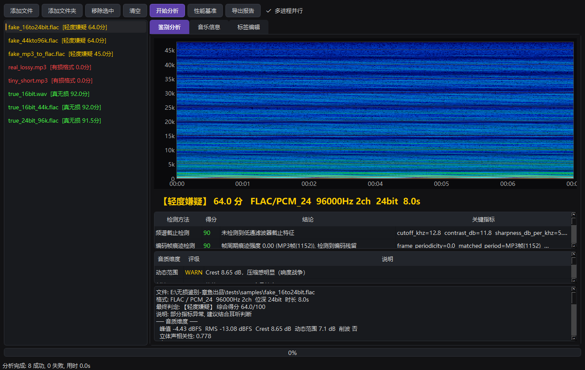

# 无损鉴别-章鱼出品V1

> **章鱼出品，必属精品** —— 无敌章鱼哥 开发


一款 **Windows 桌面端无损音频鉴别 / 音乐信息展示 / 批量标签编辑** 一体化工具。
直接分析音频 PCM 本体（而非频谱截图），精准识别"有损转码假无损"与"假 Hi-Res"，
并内置 MP3Tag 风格的批量元数据编辑能力。全程**离线本地运行**，文件不出本机。



---

## ✨ 核心功能

### 1. 无损真伪鉴别
| 检测算法 | 权重 | 原理 |
|---|---|---|
| 频谱截止检测 | 0.35 | 有损编码器的砖墙低通（MP3 128k≈15-16kHz / 320k≈20kHz）vs 真录音的自然滚降 |
| 编码帧痕迹检测 | 0.25 | MP3/AAC/Opus 固定帧长的量化噪声在高频短时能量上留下周期调制，转码后仍残留 |
| 位深量化分析 | 0.15 | 16bit→24bit 假 Hi-Res 的低 8 位恒为 0（"位空洞"统计学检测） |
| 采样率上转换检测 | 0.25 | 44.1k/48k→96k/192k 假 Hi-Res 的带宽精确止步于源奈奎斯特频率 |

- 加权融合评分（0-100 分）+ **决定性证据盖帽机制**，五级判定：
  🟢 真无损 ≥85 ｜ 🟢 大概率真无损 ≥65 ｜ 🟡 轻度嫌疑 ≥45 ｜ 🟠 大概率假无损 ≥25 ｜ 🔴 假无损 <25
- 有损文件直接生成**"损在哪"画像**：截止频率、估算码率档级、量化噪声、联合立体声压缩
- **Spek 风格频谱图**：实时渲染，红色虚线标注检测到的截止频率
- **文件头魔数嗅探**：不按扩展名猜格式——伪装成 `.flac` 的 MP4/AAC 也能被当场揭穿（列表标注 ⚠扩展名不符）
- **音质维度评级**（PASS/INFO/WARN/FAIL 三态卡）：动态范围(Crest)、削波检测、立体声相关性、简化音频指纹

### 2. 音乐信息展示
- 标题 / 艺术家 / 专辑 / 专辑艺术家 / 年代 / 流派 / 音轨号 / 碟片号 / 作曲 / 备注
- **封面**：内嵌封面提取、更换、导出、移除
- **歌词**：内嵌歌词查看与直接编辑保存
- **技术参数**：编码/容器、采样率、位深、声道、码率、时长、文件大小
- **标签标准检测**：ID3v1 / ID3v2.3/2.4 / APEv2 / Vorbis Comment / MP4 Atom / ASF
- 全部原始标签键值表

### 3. MP3Tag 风格批量标签编辑
- 表格化批量编辑：每行一个文件、每列一个字段，双击直接改，改动橙色标记
- **批量赋值**：选中多行统一填充/清除某字段
- **文件名 → 标签**：`%artist% - %title%` 模式解析
- **标签 → 重命名文件**：按模式批量重命名（含确认与非法字符过滤）
- 支持格式：MP3(ID3v1+v2.3) / FLAC / OGG / OPUS / M4A / WMA / WAV / AIFF / DSF / APE

## 📦 安装

### 方式一：安装包（推荐）
下载 [Releases](https://github.com/Zhou1019-1/UltraMusicTestTool/releases) 中的 `OctopusLosslessV1_Setup_v1.0.0.exe`，双击按向导安装即可
（免管理员权限，安装到用户目录，可选桌面快捷方式）。

### 方式二：源码运行
```bash
pip install PySide6 numpy scipy soundfile mutagen av
python run.py
```

## 🚀 快速上手

1. 点 **添加文件 / 添加文件夹**，或直接把文件/文件夹**拖进窗口**
2. 点 **开始分析**，多进程并行跑批，列表实时着色显示判定结果
3. 点击任意文件，在右侧页签间切换：
   - **鉴别分析**：频谱图 + 判定结论 + 各检测方法扣分明细 + 音质维度卡
   - **音乐信息**：封面 + 全部元数据 + 歌词 + 技术参数
   - **标签编辑**：表格批量改标签，改完点 **保存修改**
4. **导出报告** 可生成整批文件的文本检测报告

更多细节见 [使用说明书](docs/使用说明书.md)。

## 🧪 测试

```bash
python tests/gen_samples.py            # 生成已知真值的测试样本
python tests/run_verification.py       # 鉴别准确性验证 (8/8)
python tests/test_metadata_quality.py  # 元数据/音质单元测试 (27 项)
python tests/test_gui_smoke.py         # GUI 无头冒烟测试
```

## 🛠 打包

```bash
python build.py                        # PyInstaller -> dist/
# 再用 Inno Setup 6 编译 installer/setup.iss -> 安装包
```

## ⚠️ 使用须知

- 启发式分析存在理论误报率：电子乐等天然高频少的流派、极端母带处理可能影响判定，结果建议结合耳听综合判断
- 平台加密音频（如网易云/QQ音乐加密缓存）无法解码，需先解密
- 时长 <1 秒的文件无法做频谱截止分析

## 👤 作者

**无敌章鱼哥** —— 章鱼出品，必属精品 🐙

## 🙏 致谢

检测方法论参考：Spek / auCDtect / Tau Analyzer / Lossless Audio Checker 及音频取证领域公开研究。
